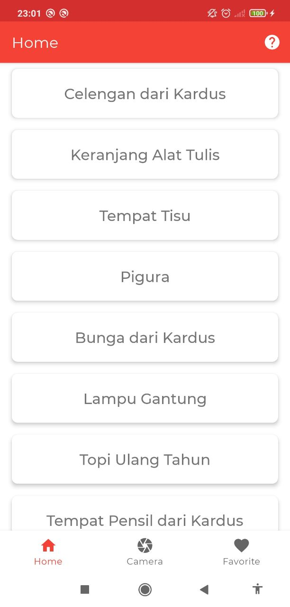
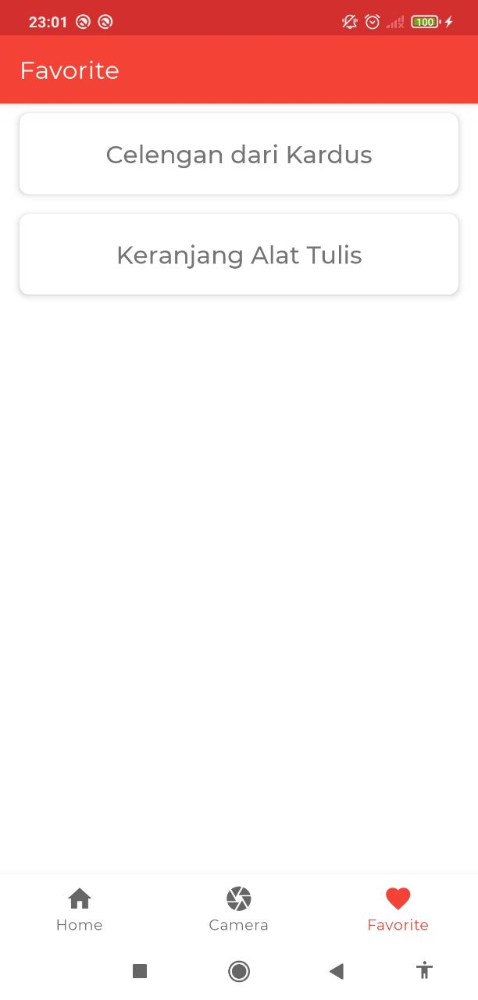
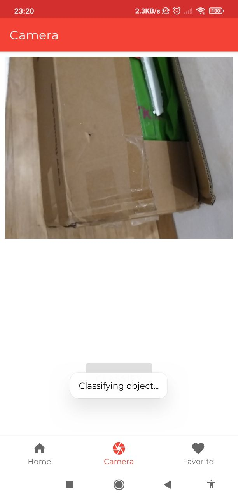
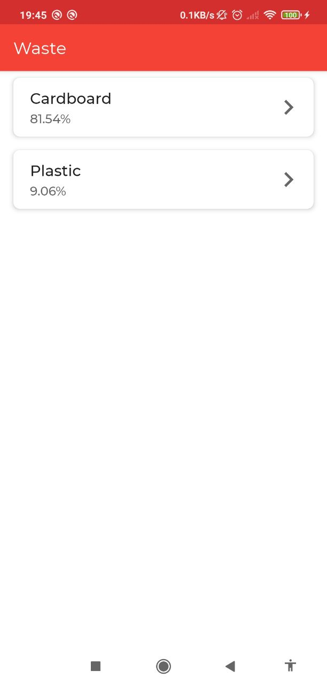
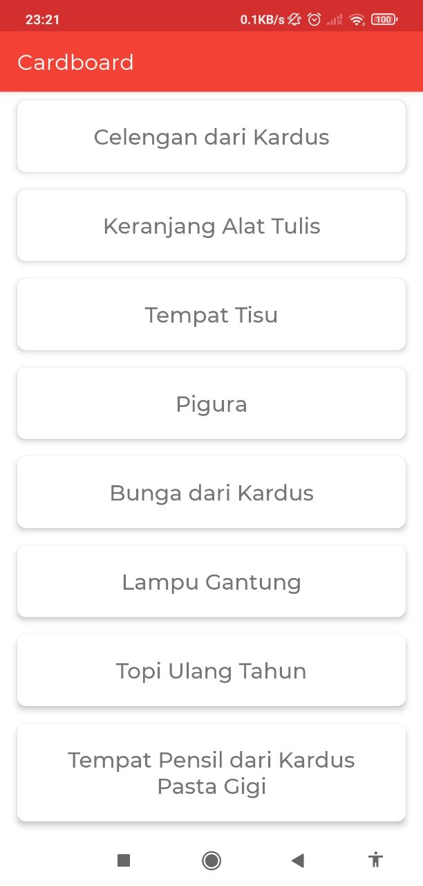
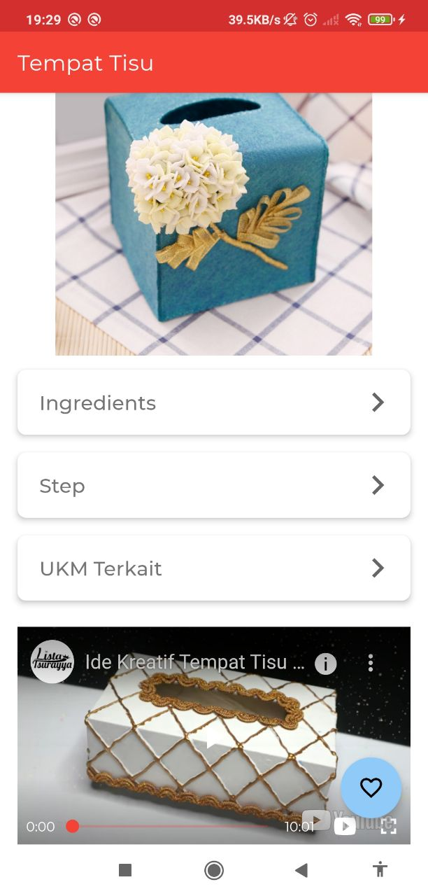

<h1 align="center">GWaste: Get to know your Waste</h1>
<h3 align="center">Android Apps</h3>

## Features

- Get all recommendation product
- Get prediction from object capture
- Get product related from prediction
- Favorite the product
- Product ingredient & step
- UKM/ IKM related to the product

## Screenshots

<p align="center">
  
  
  
  
  
  
</p>

## Getting Started

### Prerequisites

- [Android Studio 4.2.1](https://developer.android.com/studio)


### Run Locally

1. Clone the project

   ```sh
   $ git clone https://github.com/GWaste/waste-android
   ```

2. Open with Android Studio

## Tech Stack

- Kotlin
- AndroidX
- CameraX

## Library Used

- [Youtube Player](https://github.com/PierfrancescoSoffritti/android-youtube-player)

## Contributing

Contributions are always welcome!

Feel free to clone, use, and contribute via pull request.

Got an issue? Please use [issues panel](https://github.com/GWaste/waste-android/issues)

We are exciting to see your contributions!

## Feedback

If you have any feedback, please reach out to us at b21-cap0331@bangkit.academy
or contact one of our member.

## Acknowledgements

 - [Bangkit](http://bangkit.academy/)
